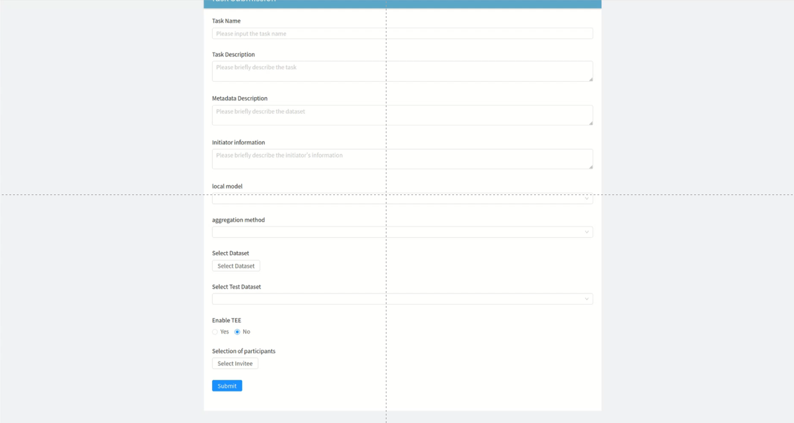
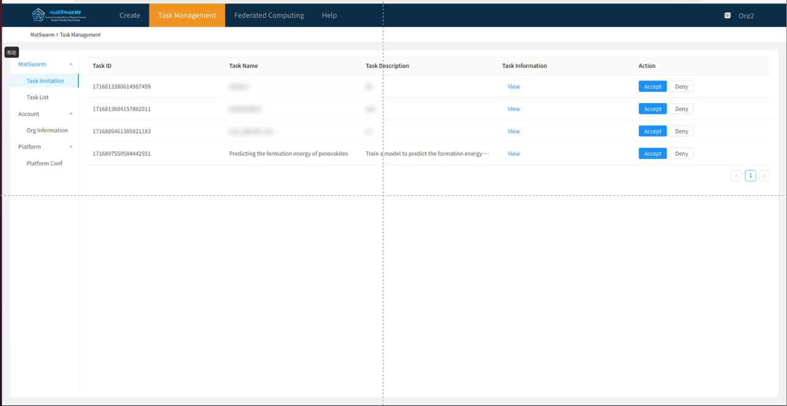
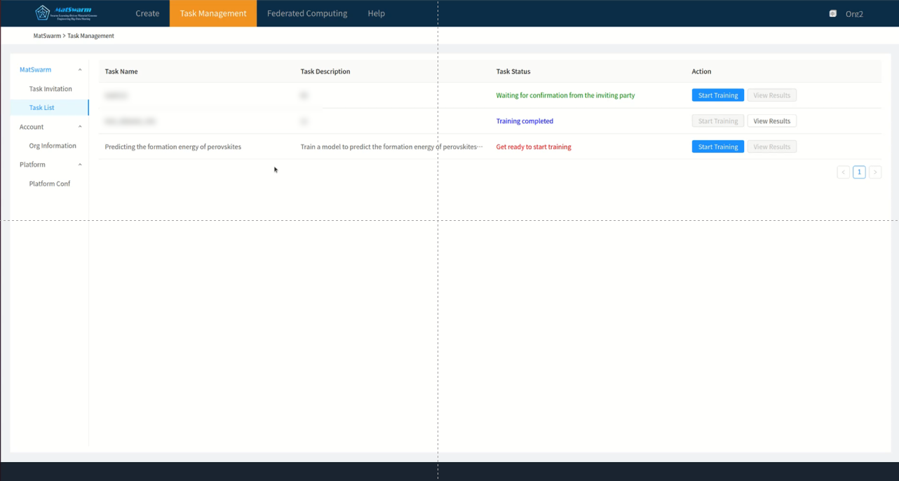
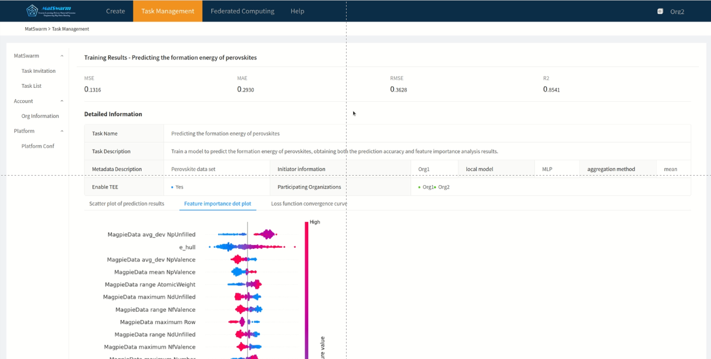

# MatSwarm

For an English version of this ReadMe file, please refer to [README.md](README.md).

#### 介绍

这是MatSwarm联邦计算系统的官方演示项目。

#### MatSwarm 联邦计算系统架构

MatSwarm 联邦计算系统可分为以下四个主要实体：

##### 1. 客户端

客户端主要用于提供用户与系统交互的入口，并将用户向服务器请求的资源呈现出来，显示在对应的页面中。

##### 2. 可信 Web 服务器

作为系统的请求转发中枢，可信 Web 服务器向上与客户端直接交互，向下分别向区块链与云服务器发送对应请求，便于数据隔离。为了保证检索结果的可信性同时提高检索效率，引入 MPT 树作为检索数据结构，解决搜索中的结果验证问题，并将 MPT 树存储到 Web 服务器中。

##### 3. 云服务器

云服务器是系统的数据存储中枢，存储包括日志记录、数据全文等数据，并负责联邦计算任务的训练计算过程。

##### 4. 区块链

系统的安全中枢，区块链内部划分为三个层面：

- **接口层**：为区块链与系统中其他部分交互的入口。
- **应用层**：负责业务逻辑的实现。链码（智能合约）是在系统中创建交易的唯一方式，是外界与区块链系统交互的唯一渠道。
- **服务层**：为区块链内部提供的基础服务，包括公式服务、链码服务、成员服务、安全及密码服务等。


#### 安装教程

##### 环境准备

**平台**： ubuntu:18.04
**搭建顺序**：

- go项目
- python项目
- 前端项目

**前提准备**
安装和启动docker

```Bash
#二、docker：
## 先更新下软件包: apt upgrade
##1、安装docker
sudo apt-get install -y docker.io
##2、启动docker服务
sudo systemctl start docker
##3、设置开机启动
sudo systemctl enable docker
##4、查看docker状态
sudo systemctl status docker
##5、停止docker服务
sudo systemctl stop docker
##6、查看docker版本：
docker version
# 安装docker-compose
sudo apt install docker-compose
```

安装和启动mongodb

```Bash
#三、mongodb：
# 参考官网：https://www.mongodb.com/docs/manual/tutorial/install-mongodb-on-ubuntu/
##1.安装
sudo apt-get install gnupg curl # 安装 gnugp 和 curl
curl -fsSL https://pgp.mongodb.com/server-6.0.asc | \
   sudo gpg -o /usr/share/keyrings/mongodb-server-6.0.gpg \
   --dearmor
# 设置mongodb软件包源
echo "deb [ arch=amd64,arm64 signed-by=/usr/share/keyrings/mongodb-server-6.0.gpg ] https://repo.mongodb.org/apt/ubuntu bionic/mongodb-org/6.0 multiverse" | sudo tee /etc/apt/sources.list.d/mongodb-org-6.0.list
sudo apt-get update # 更新软件包
sudo apt-get install -y mongodb-org # 安装mongodb
##2.运行
sudo systemctl start mongod # 启动
sudo systemctl status mongod # 查看状态
sudo systemctl enable mongod # 设置开机自启动
sudo systemctl stop mongod # 停止
sudo systemctl restart mongod # 重启
mongosh # 连接mongodb
    # 创建MGE数据库
    # use MGE
##3.卸载
sudo service mongod stop
sudo apt-get purge mongodb-org*
sudo rm -r /var/log/mongodb
sudo rm -r /var/lib/mongodb
```


##### go项目（fabric区块链+webserver）

先运行相关docker服务，再运行go服务

⚠️注意：go建议使用1.18版本，1.21版本在启动项目时会运行失败，以下为报错信息

安装golang:

```Bash
wget https://golang.google.cn/dl/go1.18.10.linux-amd64.tar.gz -O go1.18.tar.gz # 下载go1.18版本
sudo ln -s /usr/local/go1.18/bin/go /usr/local/bin/go1.18 # 创建软链接
sudo ln -s /usr/local/go/bin/gofmt /usr/local/bin/gofmt # 创建软链接

go env -w GO111MODULE=on # 设置go mod 包管理
go env -w GOPROXY=https://goproxy.io,direct # 设置国内代理
```

进入项目文件夹

```Bash
cd fabric-mge
```

启动项目：

运行相关的docker服务:需在etc/hosts文件中追加如下信息(域名解析，将对应域名地址解析到本地)

```
127.0.0.1  orderer.example.com
127.0.0.1  peer0.org1.example.com
127.0.0.1  ca.org1.example.com
127.0.0.1  peer0.org2.example.com
127.0.0.1  ca.org2.example.com
```

```Bash
# 在第一次启动时需进入项目的fixtures目录下，执行一下命令拉取相关镜像和启动容器
sudo docker-compose up -d
# 在项目目录(fabric-mge/)下执行clean_docker.sh脚本启动docker服务 
sudo ./clean_docker.sh
```

```Bash
go mod tidy # 下载相关包
cd chaincode # 下载chaincode目录下相关包
    go mod tidy 
    go mod vendor

# 回到项目根目录构建项目
go build main.go # 构建项目
# 启动项目
./main InitBlock   #初始化区块链,正常一条龙服务，第一次生成docker容器的时候需要使用这个命令启动
./main NotInitBlock #直接启动web服务器,在有区块链网路的情况下使用这个命令启动
```


##### python项目（云服务器）

**详细流程见项目文件夹（fabric-mge-backend/）内 README.md 文件**

安装python3.9、MongoDB、Mosquitto

进入项目文件夹

```bash
cd fabric-mge-backend/
pip3 install install -r ./requirements.txt
```

**配置更改**

将出现localhost:27017的地方改为MongoDB的运行地址和端口

**修改文件**

fabric-mge-backend/apps/fl/FL_for_matdata/config.py:

- PYTHON_PATH改为安装的Python中python.exe的绝对地址
- 将MQTT_SERVER改为Mosquitto的运行地址

**修改文件**

fabric-mge-backend/djangoProject/settings.py:

- DEBUG修改为True

**启动项目**

python3 manage.py runserver 8000


##### React项目（客户端）

建议node使用v14.19.2版本

安装node:

```Bash
# 在/usr/local目录下下载文件
sudo wget https://nodejs.org/dist/v14.19.2/node-v14.19.2-linux-x64.tar.gz

# 解压文件
sudo tar -zxvf node-v14.19.2-linux-x64.tar.gz

# 软链接到某个$PATH目录下(/usr/local/bin)
sudo ln -s /usr/local/node-v14.19.2-linux-x64/bin/node /usr/local/bin/node
sudo ln -s /usr/local/node-v14.19.2-linux-x64/bin/npm /usr/local/bin/npm
sudo ln -s /usr/local/node-v14.19.2-linux-x64/bin/npx /usr/local/bin/npx
sudo ln -s /usr/local/node-v14.19.2-linux-x64/bin/corepack /usr/local/bin/corepack

# 查看是否安装成功
node -v # 查看node版本
npm -v # 查看npm版本
 
# 设置淘宝代理
npm config set registry https://registry.npm.taobao.org/
```

```Bash
# 进入项目文件夹
cd fabric-frontend/

npm install # 安装依赖
npm run dll # 模拟打包

npm run start # 启动项目命令
```

当出现进度条卡在94%的情况，删除客户端项目根目录下的dist/文件夹，再运行

```bash
npm run dll
npm run start
```


#### 使用说明

1. 启动项目

   根据第二部分的流程完成项目搭建部署工作，打开浏览器访问 http://localhost:18080/search 进入首页。

1. 创建模板+数据

   进入创建模板页面，拖动动态容器组件完成模板创建。之后进入创建数据页面，点选已有模板，填写相关数据完成数据创建。

1. 提交联邦计算任务

   在任务发布界面上，填写并选择任务的相关信息，包括是否启用可信执行环境（TEE）和训练数据集。然后，单击“提交”以发布任务。


1. 被邀请组织接受邀请

   受邀者将收到任务发布消息，并可以查看相关任务信息。如果受邀者单击“接受”，则表示他们已加入任务，并将选择本地训练数据集。


1. 发起人开始训练

   当任务发布者收到受邀者的任务接受消息时，他们可以单击“启动”按钮。所有接受任务的受邀者将同时开始训练任务。


1. 查看训练结果

   训练任务开始后，您可以通过任务列表监控任务的进度。任务完成后，每位参与者将收到钙钛矿形成能量的预测结果。


#### 参与贡献

1.  Fork 本仓库
2.  新建 Feat_xxx 分支
3.  提交代码
4.  新建 Pull Request


