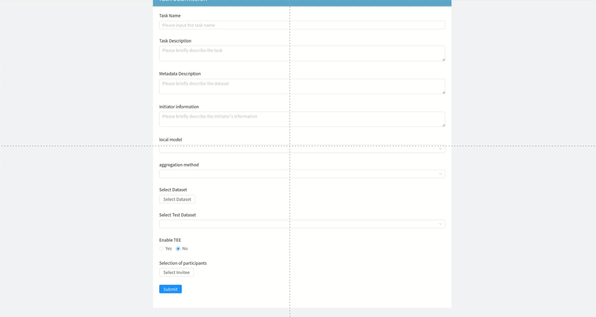
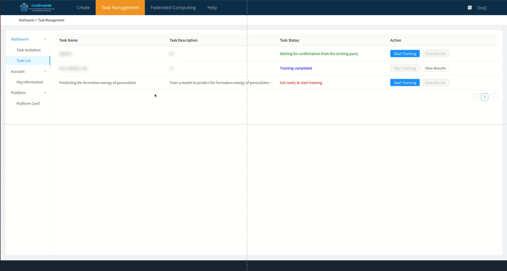

# MatSwarm

#### Introduction

This is the official demonstration project for the MatSwarm federated computing system. For details, please refer to the paper [MatSwarm](https://rdcu.be/dYm1R).

Please cite the following article if you find this code useful in your work.

```
@article{wang2024matswarm,
  title={Matswarm: trusted swarm transfer learning driven materials computation for secure big data sharing},
  author={Wang, Ran and Xu, Cheng and Zhang, Shuhao and Ye, Fangwen and Tang, Yusen and Tang, Sisui and Zhang, Hangning and Du, Wendi and Zhang, Xiaotong},
  journal={Nature Communications},
  volume={15},
  number={1},
  pages={9290},
  year={2024},
  publisher={Nature Publishing Group UK London}
}
```

#### MatSwarm Federated Computing System Architecture

The MatSwarm federated computing system can be divided into the following four main entities:

##### 1. Client

The client primarily serves as the user's gateway to interact with the system and displays resources requested from the server on the corresponding pages.

##### 2. Trusted Web Server

As the system's request forwarding hub, the trusted web server interacts directly with clients above and sends corresponding requests to the blockchain and cloud servers below, facilitating data isolation. To ensure the credibility of search results and improve search efficiency, an MPT tree is used as the search data structure. The MPT tree is stored on the web server.

##### 3. Cloud Server

The cloud server is the system's data storage hub, storing logs, full text data, and managing the computation process for federated computing tasks.

##### 4. Blockchain

The security center of the system, the blockchain is divided into three layers:

- **Interface Layer**: Serves as the entry point for interactions between the blockchain and other parts of the system.
- **Application Layer**: Responsible for implementing business logic. Chaincode (smart contracts) is the only way to create transactions in the system, serving as the sole channel for external interactions with the blockchain system.
- **Service Layer**: Provides fundamental services within the blockchain, including formula services, chaincode services, member services, security, and cryptographic services.

#### Installation Tutorial

##### Environment Setup

**Platform**: ubuntu:18.04
**Setup order**:

- Go project
- Python project
- Frontend project

**Prerequisites**
Install and start docker

```Bash
# Docker:
## First, update the software package: apt upgrade
##1. Install docker
sudo apt-get install -y docker.io
##2. Start docker service
sudo systemctl start docker
##3. Set to start on boot
sudo systemctl enable docker
##4. Check docker status
sudo systemctl status docker
##5. Stop docker service
sudo systemctl stop docker
##6. Check docker version:
docker version
# Install docker-compose
sudo apt install docker-compose
```

Install and start mongodb
```bash
# MongoDB:
# Refer to the official website: https://www.mongodb.com/docs/manual/tutorial/install-mongodb-on-ubuntu/
##1. Install
sudo apt-get install gnupg curl # Install gnupg and curl
curl -fsSL https://pgp.mongodb.com/server-6.0.asc | \
   sudo gpg -o /usr/share/keyrings/mongodb-server-6.0.gpg \
   --dearmor
# Set MongoDB package source
echo "deb [ arch=amd64,arm64 signed-by=/usr/share/keyrings/mongodb-server-6.0.gpg ] https://repo.mongodb.org/apt/ubuntu bionic/mongodb-org/6.0 multiverse" | sudo tee /etc/apt/sources.list.d/mongodb-org-6.0.list
sudo apt-get update # Update software packages
sudo apt-get install -y mongodb-org # Install mongodb
##2. Run
sudo systemctl start mongod # Start
sudo systemctl status mongod # Check status
sudo systemctl enable mongod # Set to start on boot
sudo systemctl stop mongod # Stop
sudo systemctl restart mongod # Restart
mongosh # Connect to MongoDB
    # Create MGE database
    # use MGE
##3. Uninstall
sudo service mongod stop
sudo apt-get purge mongodb-org*
sudo rm -r /var/log/mongodb
sudo rm -r /var/lib/mongodb
```

**Go project (Fabric blockchain + webserver)**
First, run related Docker services, then run the Go service

⚠️Note: It is recommended to use Go version 1.18, as version 1.21 may fail when starting the project. Here is the error message

Install golang:
```bash
wget https://golang.google.cn/dl/go1.18.10.linux-amd64.tar.gz -O go1.18.tar.gz # Download Go version 1.18
sudo ln -s /usr/local/go1.18/bin/go /usr/local/bin/go1.18 # Create symlink
sudo ln -s /usr/local/go/bin/gofmt /usr/local/bin/gofmt # Create symlink

go env -w GO111MODULE=on # Set Go mod package management
go env -w GOPROXY=https://goproxy.io,direct # Set domestic proxy
```
Enter the project folder
```bash
cd fabric-mge
```
Start the project:

Run related Docker services: Add the following information to the /etc/hosts file for domain name resolution (resolving corresponding domain addresses to localhost)
```
127.0.0.1  orderer.example.com
127.0.0.1  peer0.org1.example.com
127.0.0.1  ca.org1.example.com
127.0.0.1  peer0.org2.example.com
127.0.0.1  ca.org2.example.com
```
```bash
# On the first launch, go to the project's fixtures directory and execute the following command to pull related images and start the container
sudo docker-compose up -d
# In the project directory (fabric-mge/), execute the clean_docker.sh script to start Docker services
sudo ./clean_docker.sh
```
```bash
go mod tidy # Download related packages
cd chaincode # Download packages in the chaincode directory
    go mod tidy 
    go mod vendor

# Return to the project root directory to build the project
go build main.go # Build the project
# Start the project
./main InitBlock   # Initialize the blockchain, normally a one-stop service, this command is needed to start when generating Docker containers for the first time
./main NotInitBlock # Directly start the web server, use this command when there is a blockchain network
```

**Python project (cloud server)**
**Detailed process is in the project folder (fabric-mge-backend/) inside the README.md file**
Install Python 3.9, MongoDB, Mosquitto

Enter the project folder
```bash
cd fabric-mge-backend/
pip3 install install -r ./requirements.txt
```
**Configuration Changes**

Change occurrences of localhost:27017 to the running address and port of MongoDB

**Modify File**

fabric-mge-backend/apps/fl/FL_for_matdata/config.py:

PYTHON_PATH changed to the absolute address of python.exe in the installed Python
Change MQTT_SERVER to the running address of Mosquitto

**Modify File**

fabric-mge-backend/djangoProject/settings.py:

Change DEBUG to True

**Start the Project**
```bash
python3 manage.py runserver 8000
```

**React Project (Client)**
It is recommended to use node version v14.19.2

Install node:
```bash
# Download the file in the /usr/local directory
sudo wget https://nodejs.org/dist/v14.19.2/node-v14.19.2-linux-x64.tar.gz

# Unzip the file
sudo tar -zxvf node-v14.19.2-linux-x64.tar.gz

# Create a symlink in a $PATH directory (/usr/local/bin)
sudo ln -s /usr/local/node-v14.19.2-linux-x64/bin/node /usr/local/bin/node
sudo ln -s /usr/local/node-v14.19.2-linux-x64/bin/npm /usr/local/bin/npm
sudo ln -s /usr/local/node-v14.19.2-linux-x64/bin/npx /usr/local/bin/npx
sudo ln -s /usr/local/node-v14.19.2-linux-x64/bin/corepack /usr/local/bin/corepack

# Check if the installation was successful
node -v # Check node version
npm -v # Check npm version

# Set Taobao proxy
npm config set registry https://registry.npm.taobao.org/
```
```bash
# Enter the project folder
cd fabric-frontend/

npm install # Install dependencies
npm run dll # Simulate packaging

npm run start # Start project command
```
If the progress bar gets stuck at 94%, delete the dist/ folder in the root directory of the client project and then run
```bash
npm run dll
npm run start
```
#### Usage Instructions
1. Start the project

Follow the process in Part 2 to complete the project setup and deployment, then open a browser and access http://localhost:18080/search to enter the homepage.

2. Create Template + Data

Enter the template creation page, drag and drop dynamic container components to complete the template creation. Then enter the data creation page, select an existing template, and fill in the relevant data to complete the data creation.

3. Submit Federated Computing Task

On the task release page, fill in and select the relevant information for the task, including whether to enable a Trusted Execution Environment (TEE) and the training dataset. Then, click "Submit" to release the task.


4. Invited Organizations Accept Invitation

Invitees will receive a task release message and can view related task information. If invitees click "Accept", it means they have joined the task and will select the local training dataset.


5. Initiator Starts Training

When the task publisher receives the task acceptance message from the invitees, they can click the "Start" button. All invitees who have accepted the task will start training simultaneously.


6. View Training Results

After the training task starts, you can monitor the progress of the task through the task list. Once the task is completed


#### Contribution

1.  Fork the repository
2.  Create Feat_xxx branch
3.  Commit your code
4.  Create Pull Request

